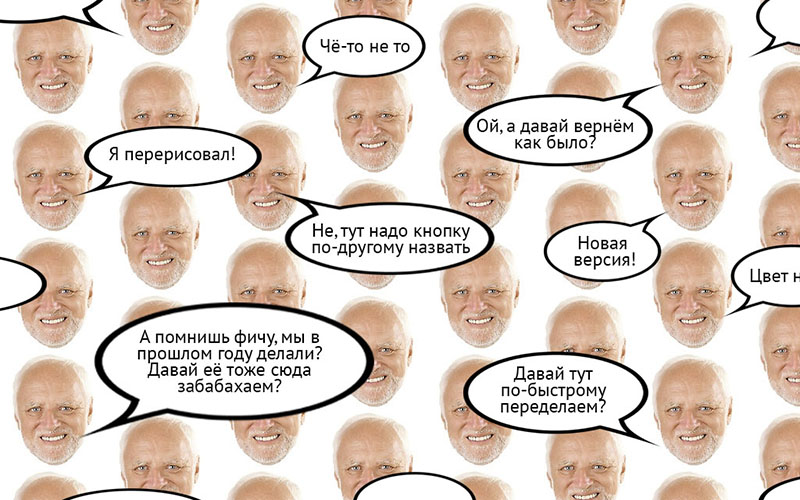

> [Read description in English](./docs/en.md). The project translation is on the way. Stay tuned!

# Фронтенд — это не больно!

О том как работать в кайф. [Пособие](https://bespoyasov.ru/front-not-pain/) для разработчиков и сочувствующих.

## О чём это и для кого

У фронтендеров часто бомбит.

Дизайнеры просят подвинуть логотип на пиксель вправо, 100500 раз переделывают уже готовые страницы, бекендеры ломают API, тестировщики кидают таски обратно в разработку, менеджеры ставят адовые сроки.

Грустные фронтендеры пытаются бороться с этим, но сдаются и утопают в рутине.

Это пособие поможет им справляться с задачами быстрее и качественнее, научиться разделываться с рутиной и получать удовольствие от работы.

Читайте, делитесь, предлагайте идеи и улучшения! Сделаем нашу работу проще :–)

## Ссылочки

- [Пособие «Фронтенд — это не больно!»](https://bespoyasov.ru/front-not-pain/)
- [Чеклист: что делать, чему учиться, как себя проверять](https://bespoyasov.ru/front-not-pain/checklist.html)

## Лицензии

Текст пособия распространяется под лицензией [CC BY-NC-SA 4.0](https://creativecommons.org/licenses/by-nc-sa/4.0/). Вы можете копировать, изменять и использовать его в проектах на некоммерческой основе. Исходный код проекта распространяется под лицензией [MIT](https://opensource.org/licenses/MIT).
